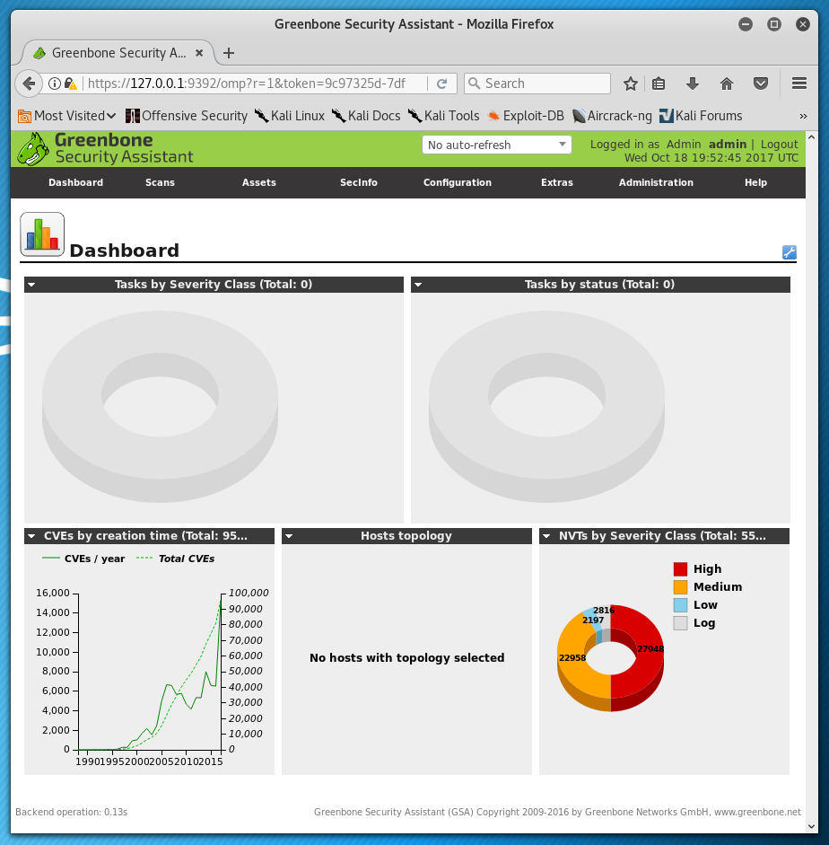

{}

## Screenshots



## OpenVAS Usage Examples

Before trying to do anything with OpenVAS, you must first run the setup script, appropriately named `openvas-setup`. At the end of the (very long) setup process, the automatically created password will be displayed to you. **Save the password somewhere safe**.

```
root@kali:~# openvas-setup
ERROR: Directory for keys (/var/lib/openvas/private/CA) not found!
ERROR: Directory for certificates (/var/lib/openvas/CA) not found!
ERROR: CA key not found in /var/lib/openvas/private/CA/cakey.pem
ERROR: CA certificate not found in /var/lib/openvas/CA/cacert.pem
ERROR: CA certificate failed verification, see /tmp/tmp.YpvirUZgxc/openvas-manage-certs.log for details. Aborting.

ERROR: Your OpenVAS certificate infrastructure did NOT pass validation.
       See messages above for details.
Generated private key in /tmp/tmp.XwwD8IOl5u/cakey.pem.
Generated self signed certificate in /tmp/tmp.XwwD8IOl5u/cacert.pem.
Installed private key to /var/lib/openvas/private/CA/cakey.pem.
Installed certificate to /var/lib/openvas/CA/cacert.pem.
Generated private key in /tmp/tmp.XwwD8IOl5u/serverkey.pem.
Generated certificate request in /tmp/tmp.XwwD8IOl5u/serverrequest.pem.
[...]
znc_detect.nasl
znc_detect.nasl.asc
zone_alarm_local_dos.nasl
zone_alarm_local_dos.nasl.asc
OpenVAS community feed server - http://www.openvas.org/
This service is hosted by Greenbone Networks - http://www.greenbone.net/

All transactions are logged.

If you have any questions, please use the OpenVAS mailing lists
or the OpenVAS IRC chat. See http://www.openvas.org/ for details.

By using this service you agree to our terms and conditions.

Only one sync per time, otherwise the source ip will be blocked.

receiving incremental file list
./
COPYING
          1,493 100%    1.42MB/s    0:00:00 (xfr#1, to-chk=84/86)
COPYING.asc
            181 100%  176.76kB/s    0:00:00 (xfr#2, to-chk=83/86)
nvdcve-2.0-2002.xml

...

sha1sums
          2,002 100%    2.34kB/s    0:00:00 (xfr#33, to-chk=2/36)
timestamp
             13 100%    0.02kB/s    0:00:00 (xfr#34, to-chk=1/36)
timestamp.asc
            181 100%    0.21kB/s    0:00:00 (xfr#35, to-chk=0/36)

sent 719 bytes  received 41,272,464 bytes  398,774.71 bytes/sec
total size is 41,260,051  speedup is 1.00
/usr/sbin/openvasmd
User created with password 'xxxxxxxx-xxxx-xxxx-xxxx-xxxxxxxxxx'.
```

After the setup completes, you will find two listening TCP ports: 9390 and 9392. Port 9392 is likely the one of most interest to you as it is the web interface for OpenVAS. You can open the web interface using your browser of choice.

```
root@kali:~# ss -lnt4
State      Recv-Q Send-Q Local Address:Port               Peer Address:Port
LISTEN     0      128     127.0.0.1:9390                        *:*
LISTEN     0      128     127.0.0.1:9392                        *:*

root@kali:~# firefox https://127.0.0.1:9392
```

Despite reminding people to save the default password generated during setup, it still sometimes gets misplaced. Fortunately, the “openvasmd” utility can be used to create and remove users as well as reset their passwords.

```
root@kali:~# openvasmd --create-user=dookie
User created with password 'yyyyyyyy-yyyy-yyyy-yyyy-yyyyyyyyyy'.
root@kali:~# openvasmd --get-users
admin
dookie
root@kali:~# openvasmd --user=dookie --new-password=s3cr3t
root@kali:~# openvasmd --user=admin --new-password=sup3rs3cr3t
```

OpenVAS signatures can be updated with the “openvas-feed-update” utility.

```
root@kali:~# openvas-feed-update
Updating OpenVas Feeds
OpenVAS community feed server - http://www.openvas.org/
This service is hosted by Greenbone Networks - http://www.greenbone.net/

All transactions are logged.

If you have any questions, please use the OpenVAS mailing lists
or the OpenVAS IRC chat. See http://www.openvas.org/ for details.
[...]
```

Verify the certificates that are configured for OpenVAS.

```
root@kali:~# openvas-manage-certs -V
OK: Directory for keys (/var/lib/openvas/private/CA) exists.
OK: Directory for certificates (/var/lib/openvas/CA) exists.
OK: CA key found in /var/lib/openvas/private/CA/cakey.pem
OK: CA certificate found in /var/lib/openvas/CA/cacert.pem
OK: CA certificate verified.
OK: Certificate /var/lib/openvas/CA/servercert.pem verified.
OK: Certificate /var/lib/openvas/CA/clientcert.pem verified.

OK: Your OpenVAS certificate infrastructure passed validation.
```
